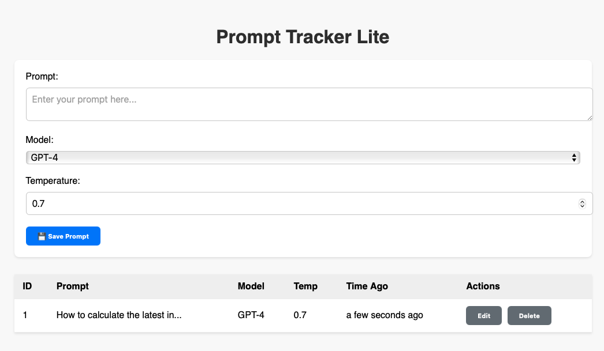

# Prompt Tracker Lite

Prompt Tracker Lite is a simple Flask web app that lets you save and manage prompts sent to AI models like GPT-4, Claude, and Mistral.

## 🚀 Features

- 📝 Save prompts with associated model and temperature
- 📋 View a history of saved prompts
- ✏️ Edit or 🗑️ Delete entries dynamically (without full page reloads)
- 🕒 Friendly timestamps (e.g. "5 mins ago")

## 📦 Tech Stack

- **Backend:** Python, Flask, SQLAlchemy, SQLite
- **Frontend:** HTML, CSS, Vanilla JavaScript

## 📂 To Run Locally

```bash
git clone https://github.com/ajaffer/prompt_tracker_lite.git
cd prompt_tracker_lite
pip install -r requirements.txt
python server.py
```

Then visit [http://localhost:5000](http://localhost:5000) in your browser.

## 🧪 To Run on Replit

If you’re viewing this project on [Replit](https://replit.com/@ahsenjaffer/prompttrackerlite):

- Click the **"Run"** button
- Open the **Webview** tab or generated live URL

> ⚠️ Note: Deploying public URLs on Replit requires a paid plan.

## 🖼️ Screenshot



## 📄 License

MIT – feel free to fork, reuse, or extend.

